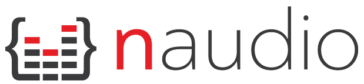

NAudio is an open source .NET audio library written by [Mark Heath](https://markheath.net)

## Features

* Play back audio using a variety of APIs
    * WaveOut
    * DirectSound
    * ASIO
    * WASAPI
* Read audio from many standard file formats 
    * WAV
    * AIFF
    * MP3 (using ACM, DMO or MFT)
    * G.711 mu-law and a-law
    * ADPCM, G.722, Speex (using NSpeex)
    * WMA, AAC, MP4 and more others with Media Foundation
* Convert between various forms of uncompressed audio
    * Change the number of channels - Mono to stereo, stereo to mono
    * Modify bit depth (8, 16, 24, 32 integer or 32 bit IEEE float)
    * Resample audio using a choice of resampling algorithms
* Encode audio using any ACM or Media Foundation codec installed on your computer
    * Create MP3s (Windows 8 and above)
    * Create AAC/MP4 audio (Windows 7 and above)
    * Create WMA files
    * Create WAV files containing G.711, ADPCM, G.722, etc.
* Mix and manipulate audio streams using a 32-bit floating mixing engine
    * construct signal chains 
    * examine sample levels for the purposes of metering or waveform rendering
    * pass blocks of samples through an FFT for metering or DSP
    * delay, loop, or fade audio in and out
    * Perform EQ with a BiQuad filter (allowing low pass, high pass, peaking EQ, etc.)
    * Pitch shifting of audio with a phase vocoder
* Record audio using a variety of capture APIs
    * WaveIn
    * WASAPI
    * ASIO
* Record system audio with WASAPI Capture
* Work with soundcards
    * Enumerate devices
    * Access soundcard controls and metering information
* Full MIDI event model
    * Read and write MIDI files
    * Respond to received MIDI events
    * Send MIDI events
* An extensible programming model
    * All base classes easily inherited from for you to add your custom components
* Support for UWP (preliminary)
    * Create Windows 8 Store apps and Windows Universal apps

## Getting Started

The easiest way to install NAudio into your project is to install the latest [NAudio NuGet package](https://www.nuget.org/packages/NAudio/). Prerelease versions of NAudio are also often made available on NuGet.

Alternatively, you can download the latest release in binary format from [here](https://github.com/naudio/NAudio/releases).

NAudio comes with several demo applications which are the quickest way to see how to use the various features of NAudio. You can download compiled demo applications from [here](https://github.com/naudio/NAudio/releases), and explore the source code [here](https://github.com/naudio/NAudio/tree/master/NAudioDemo).

## Tutorials

### Playback
 - [Playing an Audio File from a WinForms application](Docs/PlayAudioFileWinForms.md)
 - [Playing an Audio File from a Console application](Docs/PlayAudioFileConsoleApp.md)
 - [Playing Audio from a URL](Docs/PlayAudioFromUrl.md)
 - [Choose an audio output device type](Docs/OutputDeviceTypes.md)
 - [Enumerate and select Output Devices](Docs/EnumerateOutputDevices.md)
 - [Creating and configuring a WasapiOut device](Docs/WasapiOut.md)
 - [Implement "Fire and Forget" Playback (e.g. game sound effects)](http://markheath.net/post/fire-and-forget-audio-playback-with)
 - [Play streaming MP3](http://markheath.net/post/how-to-play-back-streaming-mp3-using)
 - [Handling playback stopped](Docs/PlaybackStopped.md)
 - [Understanding WaveStream, IWavePlayer and ISampleProvider](Docs/WaveProviders.md)
 - [Playing Audio with ASIO](Docs/AsioPlayback.md)

### Working with Codecs

 - [Convert an MP3 to WAV](Docs/ConvertMp3ToWav.md)
 - [Encode to MP3 and other formats using MediaFoundationEncoder](Docs/MediaFoundationEncoder.md)
    - [More examples](http://markheath.net/post/naudio-mediafoundationencoder)
 - [Understand how to convert between any audio formats you have codecs for](http://www.codeproject.com/Articles/501521/How-to-convert-between-most-audio-formats-in-NET)
 - [Enumerate Media Foundation Transforms (MFTs)](Docs/EnumerateMediaFoundationTransforms.md)
 - [Enumerate ACM Codecs](Docs/EnumerateAcmDrivers.md)
 - [Fix the NoDriver calling acmFormatSuggest issue](http://markheath.net/post/nodriver-calling-acmformatsuggest)

### Working with audio files

 - [Mix Two Audio Files to WAV](Docs/MixTwoAudioFilesToWav.md)
 - [Trim a WAV File](http://markheath.net/post/trimming-wav-file-using-naudio)
 - [Merge MP3 Files](http://markheath.net/post/merging-mp3-files-with-naudio-in-c-and)
 - [Convert an AIFF file to WAV](http://markheath.net/post/how-to-convert-aiff-files-to-wav-using)
 - [Use the WavFileWriter class](http://markheath.net/post/how-to-use-wavefilewriter)
 - [Create an ID3v2 tag](http://naudio.codeplex.com/wikipage?title=Create%20an%20ID3v2%20Tag)

### Manipulating audio

 - [Convert between mono and stereo](Docs/ConvertBetweenStereoAndMono.md)
 - [Concatenating Audio](Docs/ConcatenatingAudio.md)
 - [Skip and Take Using OffsetSampleProvider](Docs/OffsetSampleProvider.md)
 - [Implement Looped Playback](http://markheath.net/post/looped-playback-in-net-with-naudio)
 - [Work with Multi-Channel Audio](http://markheath.net/post/handling-multi-channel-audio-in-naudio)
 - [Resample Audio](Docs/Resampling.md)
 - [Input driven Audio Resampling](http://markheath.net/post/input-driven-resampling-with-naudio-using-acm)
 - [Using RawSourceWaveStream](Docs/RawSourceWaveStream.md)
 - [Adjust the pitch of audio using SmbPitchShiftingSampleProvider](Docs/SmbPitchShiftingSampleProvider.md)
 - [Varispeed playback with NAudio using SoundTouch](http://markheath.net/post/varispeed-naudio-soundtouch)
 - [Fade audio in and out](Docs/FadeInOutSampleProvider.md)

### Generating audio

 - [Play Sine Waves and other signal types](Docs/PlaySineWave.md)
 - [Implement sine wave with portamento](http://markheath.net/post/naudio-sine-portamento)

### Recording

 - [Recording a WAV file from a WinForms application](Docs/RecordWavFileWinFormsWaveIn.md)
 - [Capturing system audio with WasapiLoopbackCapture](Docs/WasapiLoopbackCapture.md)
 - [Play and Record audio at the same time](http://markheath.net/post/how-to-record-and-play-audio-at-same)
 - [Record Audio with ASIO](Docs/AsioRecording.md)

### Visualization

 - [WaveForm Rendering to PNG](Docs/WaveFormRendering.md)
 - [Implement a Recording Level Meter](Docs/RecordingLevelMeter.md)

### MIDI

 - [Sending and Receiving MIDI Events](Docs/MidiInAndOut.md)
 - [Exploring MIDI Files with MidiFile](Docs/MidiFile.md)
 - [MIDI Event types](Docs/MidiEvent.md)

### More...

Additional sources of documentation for NAudio are:
 - [Original Documentation on CodePlex](http://naudio.codeplex.com/documentation)
 - [NAudio articles on Mark Heath's blog](http://markheath.net/category/naudio)

## NAudio Training Courses

If you want to get up to speed as quickly as possible with NAudio programming, I recommend you watch these two Pluralsight courses. You will need to be a subscriber to access the content, but there is 10 hours of training material on NAudio, and it also will give you access to their vast training library on other programming topics.

- [Digital Audio Fundamentals](http://pluralsight.com/training/Courses/TableOfContents/digital-audio-fundamentals)
- [Audio Programming with NAudio](http://pluralsight.com/training/Courses/TableOfContents/audio-programming-naudio)

To be successful developing applications that process digital audio, there are some key concepts that you need to understand. To help developers quickly get up to speed with what they need to know before trying to use NAudio, I have created the [Digital Audio Fundamentals](http://pluralsight.com/training/Courses/TableOfContents/digital-audio-fundamentals) course, which covers sample rates, bit depths, file formats, codecs, decibels, clipping, aliasing, synthesis, visualisations, effects and much more. In particular, the fourth module on signal chains is vital background information if you are to be effective with NAudio. 

[Audio Programming with NAudio](http://pluralsight.com/training/Courses/TableOfContents/audio-programming-naudio) is a follow-on course which contains seven hours of training material covering all the major features of NAudio. It is highly recommended that you take this course if you intend to create an application with NAudio.

## How do I...?

The best way to learn how to use NAudio is to download the source code and look at the two demo applications - [NAudioDemo](https://github.com/naudio/NAudio/tree/master/NAudioDemo) and [NAudioWpfDemo](https://github.com/naudio/NAudio/tree/master/NAudioWpfDemo). These demonstrate several of the key capabilities of the NAudio framework. They also have the advantage of being kept up to date, whilst some of the tutorials you will find on the internet refer to old versions of NAudio.

## FAQ

**What is NAudio?**

NAudio is an open source audio API for .NET written in C# by Mark Heath, with contributions from many other developers. It is intended to provide a comprehensive set of useful utility classes from which you can construct your own audio application.

**Why NAudio?**

NAudio was created because the Framework Class Library that shipped with .NET 1.0 had no support for playing audio. The System.Media namespace introduced in .NET 2.0 provided a small amount of support, and the MediaElement in WPF and Silverlight took that a bit further. The vision behind NAudio is to provide a comprehensive set of audio related classes allowing easy development of utilities that play or record audio, or manipulate audio files in some way.

**Can I Use NAudio in my Project?**

NAudio is licensed under the Microsoft Public License (Ms-PL) which means that you can use it in whatever project you like including commercial projects. Of course we would love it if you share any bug-fixes or enhancements you made to the original NAudio project files.

**Is .NET Performance Good Enough for Audio?**

While .NET cannot compete with unmanaged languages for very low latency audio work, it still performs better than many people would expect. On a fairly modest PC, you can quite easily mix multiple WAV files together, including pass them through various effects and codecs, play back glitch free with a latency of around 50ms.

**How can I get help?**

There are three main ways to get help. First, you can raise an issue here on GitHub. This is the best option when you've written some code and want to ask why it's not working as you expect. I attempt to answer all questions, but since this is a spare time project, occasionally I get behind. 

You can also ask on StackOverflow and [tag your question with naudio](http://stackoverflow.com/questions/tagged/naudio), if your question is a "how do I..." sort of question. This gives you a better chance of getting a quick answer. Please try to search first to see if your question has already been answered elsewhere.

Finally, I am occasionally able to offer paid support for situations where you need quick advice, bugfixes or new features. Please contact Mark Heath directly if you wish to pursue this option.

**How do I submit a patch?**

I welcome contributions to NAudio and have accepted many patches, but if you want your code to be included, please familiarise yourself with the following guidelines:

 - Your submission must be your own work, and able to be released under the MS-PL license.
 - You will need to make sure your code conforms to the layout and naming conventions used elsewhere in NAudio.
 - Remember that there are many existing users of NAudio. A patch that changes the public interface is not likely to be accepted.
 - Try to write "clean code" - avoid long functions and long classes. Try to add a new feature by creating a new class rather than putting loads of extra code inside an existing one.
 - I don't usually accept contributions I can't test, so please write unit tests (using NUnit) if at all possible. If not, give a clear explanation of how your feature can be unit tested and provide test data if appropriate. Tell me what you did to test it yourself, including what operating systems and soundcards you used.
 - If you are adding a new feature, please consider writing a short tutorial on how to use it.
 - Unless your patch is a small bugfix, I will code review it and give you feedback. You will need to be willing to make the recommended changes before it can be integrated into the main code.
 - Patches should be provided using the Pull Request feature of GitHub.
 - Please also bear in mind that when you add a feature to NAudio, that feature will generate future support requests and bug reports. Are you willing to stick around on the forums and help out people using it?
