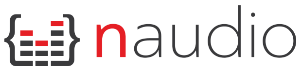

# NAudio

[](https://github.com/naudio/NAudio/blob/main/LICENSE) [](https://www.nuget.org/packages/NAudio/) [](https://github.com/naudio/NAudio/actions/workflows/build.yml)

NAudio is an open source .NET audio library written by [Mark Heath](https://markheath.net)



📖 **[Documentation site](https://naudio.github.io/NAudio/)** — tutorials and the full API reference.

## NAudio 3 pre-release

NAudio 3 is now available as a pre-release on NuGet:

```sh
dotnet add package NAudio --prerelease
```

NAudio 2 remains the stable channel and will receive critical bug fixes if necessary.

NAudio 3 is a major release. The headlines:

* **The single `NAudio` assembly is split into focused packages** — take only what you need. The `NAudio` meta-package still pulls the Windows stack together, so existing consumers see no change.
* **The core is cross-platform and Native-AOT compatible.** `NAudio.Core`, `NAudio.Midi`, `NAudio.Effects`, `NAudio.Sampler` and `NAudio.SoundFile` run on Windows, Linux and macOS.
* **Minimum target framework is `net9.0`** — legacy .NET Framework and .NET Standard 2.0 support is dropped.
* **New subsystems:** an audio effects framework, a software sampler, VST 3 hosting, ALSA playback/capture on Linux, and cross-platform file I/O via libsndfile.
* **Modernised WASAPI and ASIO** — the new `WasapiPlayer` / `WasapiRecorder` and `AsioDevice` APIs.

Upgrading from NAudio 2? Start with **[Migrating from NAudio 2 to NAudio 3](Docs/MigratingFromNAudio2.md)**. The full list of changes is in [RELEASE_NOTES.md](RELEASE_NOTES.md).

**For existing contributors:** the default branch has moved from `master` to `main` to make room for NAudio 3 development. NAudio 2 maintenance now lives on `release/2.x` (formerly `master`). Open PRs that targeted `master` have been automatically retargeted to `release/2.x` — if your change is intended for NAudio 3, it will need to be rebased against `main` and update the PR target.

## Packages

Installing the [`NAudio`](https://www.nuget.org/packages/NAudio/) meta-package gets you the full Windows stack and is the right default. On a non-Windows target framework it resolves to the cross-platform pieces only. Reference the individual packages directly if you want a smaller surface.

| Package | Platform | What it gives you |
| --- | --- | --- |
| [NAudio](https://www.nuget.org/packages/NAudio/) | any | Meta-package — the Windows stack plus `AudioFileReader` and `Mp3FileReader` |
| [NAudio.Core](https://www.nuget.org/packages/NAudio.Core/) | cross-platform | `WaveStream` / `ISampleProvider` model, WAV & AIFF I/O, mixing, resampling, DSP, `NAudio.Effects`, sequencing |
| [NAudio.Midi](https://www.nuget.org/packages/NAudio.Midi/) | cross-platform (+ WinRT MIDI on Windows) | MIDI event model, Standard MIDI File reading & writing |
| [NAudio.Wasapi](https://www.nuget.org/packages/NAudio.Wasapi/) | Windows | WASAPI playback, capture and loopback; Media Foundation codecs |
| [NAudio.WinMM](https://www.nuget.org/packages/NAudio.WinMM/) | Windows | `WaveOut` / `WaveIn`, classic MIDI I/O, ACM codecs, mixer controls |
| [NAudio.Asio](https://www.nuget.org/packages/NAudio.Asio/) | Windows | Low-latency multichannel playback and capture through ASIO drivers |
| [NAudio.Dmo](https://www.nuget.org/packages/NAudio.Dmo/) | Windows | DMO effects, DMO MP3 decoder and resampler, `DirectSoundOut` |
| [NAudio.WinForms](https://www.nuget.org/packages/NAudio.WinForms/) | Windows | WinForms controls, and the window-callback `WaveOutWindow` / `WaveInWindow` |
| [NAudio.Sampler](https://www.nuget.org/packages/NAudio.Sampler/) | cross-platform | Polyphonic software sampler — SoundFont (`.sf2`), SFZ and single-sample instruments |
| [NAudio.SoundFile](https://www.nuget.org/packages/NAudio.SoundFile/) | cross-platform | Read *and write* WAV/AIFF/FLAC/Ogg-Vorbis/Opus/MP3 via libsndfile |
| [NAudio.Alsa](https://www.nuget.org/packages/NAudio.Alsa/) | Linux | `AlsaOut` / `AlsaIn` playback and capture via libasound |
| [NAudio.Vst3](https://www.nuget.org/packages/NAudio.Vst3/) | Windows | VST 3 plug-in hosting (preview) — effects and instruments |
| [NAudio.Extras](https://www.nuget.org/packages/NAudio.Extras/) | cross-platform (+ Windows extras) | Opinionated helpers — playback engine, capture mixing, ID3 tags |

`NAudio.Core`, `NAudio.Midi`, `NAudio.Wasapi`, `NAudio.Dmo`, `NAudio.Sampler`, `NAudio.SoundFile` and `NAudio.Alsa` are Native-AOT compatible. See [the assembly layout plan](Docs/Architecture/NAudio3AssemblyLayoutPlan.md) for the reasoning behind the split.

## Documentation

* **[Documentation site](https://naudio.github.io/NAudio/)** — tutorials and the full API reference.
* **[Tutorials](#tutorials)** — the task-focused how-to guides listed below, also in [Docs/](Docs/).
* **[Migrating from NAudio 2](Docs/MigratingFromNAudio2.md)** — every breaking change, with before/after code.
* **[NAudio articles on Mark Heath's blog](http://markheath.net/category/naudio)**.

NAudio comes with several demo applications, which are the quickest way to see how the various features fit together: [NAudioDemo](samples/NAudioDemo) (WinForms), [NAudioWpfDemo](samples/NAudioWpfDemo), and the smaller [NAudioConsoleTest](samples/NAudioConsoleTest), [AudioFileInspector](samples/AudioFileInspector), [MidiFileConverter](samples/MidiFileConverter) and [MixDiff](samples/MixDiff) tools. They have the advantage of being kept up to date, whilst some of the tutorials you will find on the internet refer to old versions of NAudio.

## Features

* Play back audio using a variety of APIs
  * WASAPI (`WasapiPlayer`, and the legacy `WasapiOut`)
  * WaveOut
  * ASIO
  * DirectSound
  * ALSA on Linux
* Read audio from many standard file formats
  * WAV, AIFF and raw PCM
  * MP3 (using ACM, DMO or MFT)
  * G.711 mu-law and a-law
  * ADPCM, G.722, Opus (using Concentus)
  * WMA, AAC, MP4 and more with Media Foundation
  * FLAC, Ogg Vorbis, Opus and MP3 cross-platform with libsndfile
* Convert between various forms of uncompressed audio
  * Change the number of channels — mono to stereo, stereo to mono, and arbitrary matrix routings
  * Modify bit depth (8, 16, 24, 32 integer or 32 bit IEEE float)
  * Resample audio using a choice of resampling algorithms
* Encode audio using any ACM or Media Foundation codec installed on your computer
  * Create MP3s, AAC/MP4 audio and WMA files
  * Create WAV files containing G.711, ADPCM, G.722, etc.
  * Encode FLAC, Ogg Vorbis and Opus on any platform with `NAudio.SoundFile`
* Mix and manipulate audio streams using a 32-bit floating point mixing engine
  * construct signal chains
  * examine sample levels for the purposes of metering or waveform rendering
  * pass blocks of samples through an FFT for metering or DSP
  * delay, loop, or fade audio in and out
* Apply audio effects with the cross-platform `NAudio.Effects` framework
  * EQ and filtering, dynamics (compressor, limiter, gate, multiband), saturation and lo-fi
  * delay and modulation, reverb including FFT convolution, pitch shifting
  * click-free bypass, dry/wet mix and a parameter model for automation
* Record audio using a variety of capture APIs
  * WASAPI (`WasapiRecorder`), including system audio and per-process loopback
  * WaveIn
  * ASIO
  * ALSA on Linux
* Host VST 3 effects and instruments (preview)
* Play SoundFont (`.sf2`) and SFZ instruments with the built-in software sampler
* Work with soundcards
  * Enumerate devices
  * Access soundcard controls and metering information
  * Follow the default device automatically, and observe endpoint changes as events
* Full MIDI event model
  * Read and write MIDI files
  * Respond to received MIDI events
  * Send MIDI events
  * Render a MIDI file to audio through the sampler or a hosted VST 3 instrument
* An extensible programming model
  * All base classes easily inherited from for you to add your custom components

## Tutorials

### Upgrading

* [Migrating from NAudio 2 to NAudio 3](Docs/MigratingFromNAudio2.md)
* [Migrating from AsioOut to AsioDevice](Docs/AsioMigration.md)

### Playback

* [Playing an Audio File from a WinForms application](Docs/PlayAudioFileWinForms.md)
* [Playing an Audio File from a Console application](Docs/PlayAudioFileConsoleApp.md)
* [Playing Audio from a URL](Docs/PlayAudioFromUrl.md)
* [Choose an audio output device type](Docs/OutputDeviceTypes.md)
* [Enumerate and select Output Devices](Docs/EnumerateOutputDevices.md)
* [Playing audio with WasapiPlayer (recommended for WASAPI)](Docs/WasapiPlayer.md)
* [Creating and configuring a WasapiOut device (legacy)](Docs/WasapiOut.md)
* [Implement "Fire and Forget" Playback (e.g. game sound effects)](http://markheath.net/post/fire-and-forget-audio-playback-with)
* [Play streaming MP3](http://markheath.net/post/how-to-play-back-streaming-mp3-using)
* [Handling playback stopped](Docs/PlaybackStopped.md)
* [Understanding WaveStream, IWavePlayer and ISampleProvider](Docs/WaveProviders.md)
* [Playing Audio with ASIO](Docs/AsioPlayback.md)

### Working with Codecs

* [Convert an MP3 to WAV](Docs/ConvertMp3ToWav.md)
* [Encode to MP3 and other formats using MediaFoundationEncoder](Docs/MediaFoundationEncoder.md)
  * [More examples](http://markheath.net/post/naudio-mediafoundationencoder)
* [Understand how to convert between any audio formats you have codecs for](http://www.codeproject.com/Articles/501521/How-to-convert-between-most-audio-formats-in-NET)
* [Enumerate Media Foundation Transforms (MFTs)](Docs/EnumerateMediaFoundationTransforms.md)
* [Enumerate ACM Codecs](Docs/EnumerateAcmDrivers.md)
* [Fix the NoDriver calling acmFormatSuggest issue](http://markheath.net/post/nodriver-calling-acmformatsuggest)

### Working with audio files

* [Mix Two Audio Files to WAV](Docs/MixTwoAudioFilesToWav.md)
* [Cross-platform audio files with NAudio.SoundFile](Docs/CrossPlatformAudioFilesWithSoundFile.md)
* [Trim a WAV File](http://markheath.net/post/trimming-wav-file-using-naudio)
* [Merge MP3 Files](http://markheath.net/post/merging-mp3-files-with-naudio-in-c-and)
* [Convert an AIFF file to WAV](http://markheath.net/post/how-to-convert-aiff-files-to-wav-using)
* [Use the WavFileWriter class](http://markheath.net/post/how-to-use-wavefilewriter)

### Manipulating audio

* [Convert between mono and stereo](Docs/ConvertBetweenStereoAndMono.md)
* [Concatenating Audio](Docs/ConcatenatingAudio.md)
* [Skip and Take Using OffsetSampleProvider](Docs/OffsetSampleProvider.md)
* [Implement Looped Playback](http://markheath.net/post/looped-playback-in-net-with-naudio)
* [Work with Multi-Channel Audio](http://markheath.net/post/handling-multi-channel-audio-in-naudio)
* [Resample Audio](Docs/Resampling.md)
* [Input driven Audio Resampling](http://markheath.net/post/input-driven-resampling-with-naudio-using-acm)
* [Using RawSourceWaveStream](Docs/RawSourceWaveStream.md)
* [Adjust the pitch of audio using SmbPitchShiftingSampleProvider](Docs/SmbPitchShiftingSampleProvider.md)
* [Varispeed playback with NAudio using SoundTouch](http://markheath.net/post/varispeed-naudio-soundtouch)
* [Fade audio in and out](Docs/FadeInOutSampleProvider.md)
* [Apply audio effects with NAudio.Effects](Docs/AudioEffects.md)

### Generating audio

* [Play Sine Waves and other signal types](Docs/PlaySineWave.md)
* [Implement sine wave with portamento](http://markheath.net/post/naudio-sine-portamento)
* [Play SoundFont, SFZ and single-sample instruments](Docs/Sampler.md)

### Recording

* [Recording a WAV file from a WinForms application](Docs/RecordWavFileWinFormsWaveIn.md)
* [Recording audio with WasapiRecorder (recommended for WASAPI)](Docs/WasapiRecorder.md)
* [Capturing system audio with WasapiLoopbackCapture (legacy)](Docs/WasapiLoopbackCapture.md)
* [Mix the microphone and system audio](Docs/MixMicrophoneAndSystemAudio.md)
* [Play and Record audio at the same time](http://markheath.net/post/how-to-record-and-play-audio-at-same)
* [Record Audio with ASIO](Docs/AsioRecording.md)
* [Duplex Processing with ASIO](Docs/AsioDuplex.md)
* [ASIO Channel Mapping](Docs/AsioChannelMapping.md)
* [Handling ASIO Driver Resets](Docs/AsioDriverReset.md)

### Visualization

* [WaveForm Rendering to PNG](Docs/WaveFormRendering.md)
* [Implement a Recording Level Meter](Docs/RecordingLevelMeter.md)

### MIDI

* [Sending and Receiving MIDI Events](Docs/MidiInAndOut.md)
* [Exploring MIDI Files with MidiFile](Docs/MidiFile.md)
* [MIDI Event types](Docs/MidiEvent.md)

### Networking

* [Stream live audio over the network (Network Chat)](Docs/NetworkChatDemo.md)

### Cross-platform and Linux

* [Cross-platform audio files with NAudio.SoundFile](Docs/CrossPlatformAudioFilesWithSoundFile.md)
* [Playing an audio file on Linux with ALSA](Docs/PlayAudioFileLinuxAlsa.md)
* [Recording an audio file on Linux with ALSA](Docs/RecordAudioFileLinuxAlsa.md)
* [Validating ALSA on Linux](Docs/ValidatingAlsaOnLinux.md)

## NAudio Training Courses

If you want to get up to speed as quickly as possible with NAudio programming, I recommend you watch these two Pluralsight courses. You will need to be a subscriber to access the content, but there is 10 hours of training material on NAudio, and it also will give you access to their vast training library on other programming topics.

* [Digital Audio Fundamentals](http://pluralsight.com/training/Courses/TableOfContents/digital-audio-fundamentals)
* [Audio Programming with NAudio](http://pluralsight.com/training/Courses/TableOfContents/audio-programming-naudio)

To be successful developing applications that process digital audio, there are some key concepts that you need to understand. To help developers quickly get up to speed with what they need to know before trying to use NAudio, I have created the [Digital Audio Fundamentals](http://pluralsight.com/training/Courses/TableOfContents/digital-audio-fundamentals) course, which covers sample rates, bit depths, file formats, codecs, decibels, clipping, aliasing, synthesis, visualisations, effects and much more. In particular, the fourth module on signal chains is vital background information if you are to be effective with NAudio.

[Audio Programming with NAudio](http://pluralsight.com/training/Courses/TableOfContents/audio-programming-naudio) is a follow-on course which contains seven hours of training material covering all the major features of NAudio. It is highly recommended that you take this course if you intend to create an application with NAudio.

Please note that these courses were recorded against NAudio 1.x and 2.x. The concepts all still apply, but some of the class names have changed — see [Migrating from NAudio 2 to NAudio 3](Docs/MigratingFromNAudio2.md).

## FAQ

**What is NAudio?**

NAudio is an open source audio API for .NET written in C# by Mark Heath, with contributions from many other developers. It is intended to provide a comprehensive set of useful utility classes from which you can construct your own audio application.

**Why NAudio?**

NAudio was created because the Framework Class Library that shipped with .NET 1.0 had no support for playing audio. The System.Media namespace introduced in .NET 2.0 provided a small amount of support, and the MediaElement in WPF and Silverlight took that a bit further. The vision behind NAudio is to provide a comprehensive set of audio related classes allowing easy development of utilities that play or record audio, or manipulate audio files in some way.

**Does NAudio work on Linux and macOS?**

Partly, and much more so in NAudio 3. `NAudio.Core`, `NAudio.Midi`, `NAudio.Effects`, `NAudio.Sampler` and `NAudio.SoundFile` are fully cross-platform, so signal chains, file I/O, DSP, effects and MIDI all work anywhere .NET runs. For output and capture, Linux has `NAudio.Alsa`; the WASAPI, WinMM, ASIO, DMO and WinForms packages remain Windows-only, and there is no macOS (CoreAudio) backend yet.

**Which .NET versions are supported?**

NAudio 3 requires `net9.0` or later. If you need .NET Framework or .NET Standard 2.0, stay on NAudio 2.x.

**Can I Use NAudio in my Project?**

NAudio is licensed under the MIT license which means that you can use it in whatever project you like including commercial projects. Of course we would love it if you share any bug-fixes or enhancements you made to the original NAudio project files.

**Is .NET Performance Good Enough for Audio?**

While .NET cannot compete with unmanaged languages for very low latency audio work, it still performs better than many people would expect. On a fairly modest PC, you can quite easily mix multiple WAV files together, including pass them through various effects and codecs, play back glitch free with a latency of around 50ms.

**How can I get help?**

There are three main ways to get help. First, you can raise an issue here on GitHub. This is the best option when you've written some code and want to ask why it's not working as you expect. I attempt to answer all questions, but since this is a spare time project, occasionally I get behind.

You can also ask on StackOverflow and [tag your question with naudio](http://stackoverflow.com/questions/tagged/naudio), if your question is a "how do I..." sort of question. This gives you a better chance of getting a quick answer. Please try to search first to see if your question has already been answered elsewhere.

Finally, I am occasionally able to offer paid support for situations where you need quick advice, bugfixes or new features. Please contact Mark Heath directly if you wish to pursue this option.

**How do I submit a patch?**

I welcome contributions to NAudio and have accepted many patches, but if you want your code to be included, please familiarise yourself with the following guidelines:

* Your submission must be your own work, and able to be released under the MIT license.
* You will need to make sure your code conforms to the layout and naming conventions used elsewhere in NAudio.
* Remember that there are many existing users of NAudio. A patch that changes the public interface is not likely to be accepted.
* Try to write "clean code" - avoid long functions and long classes. Try to add a new feature by creating a new class rather than putting loads of extra code inside an existing one.
* I don't usually accept contributions I can't test, so please write unit tests (using NUnit) if at all possible. If not, give a clear explanation of how your feature can be unit tested and provide test data if appropriate. Tell me what you did to test it yourself, including what operating systems and soundcards you used.
* If you are adding a new feature, please consider writing a short tutorial on how to use it.
* Unless your patch is a small bugfix, I will code review it and give you feedback. You will need to be willing to make the recommended changes before it can be integrated into the main code.
* Patches should be provided using the Pull Request feature of GitHub.
* Please also bear in mind that when you add a feature to NAudio, that feature will generate future support requests and bug reports. Are you willing to stick around on the forums and help out people using it?
